# SportsPredictor

Sistema en Java para gestionar pronósticos deportivos (fútbol, baloncesto y tenis): permite crear pronósticos sobre eventos, evaluarlos contra el resultado real, otorgar puntos al usuario, notificar a los interesados y gestionar reportes de incidencias. Proyecto académico del curso **Diseño de Software** (ESPOL) — Grupo 5.

## Patrones de diseño

| Patrón | Rol |
| --- | --- |
| **Factory Method** | `CreadorPronostico` y sus subclases crean el `Pronostico` correcto según el deporte. |
| **Observer** | `GestorNotificaciones` avisa a los observadores suscritos (email, mensajería, push) cuando hay una notificación. |
| **Adapter** | `ProveedorEstadisticasAdapter` adapta la API simulada `ProveedorDatosExterno` a la interfaz `ServicioEstadisticas` que usa el sistema. |
| **Chain of Responsibility** | Un `ReporteIncidencia` pasa primero por `ManejadorSoporte`; si no se puede resolver, se escala a `ManejadorControlCalidad`. |

## Diagrama de clases

```mermaid
classDiagram
    %% ---- Factory Method: Pronosticos ----
    class Pronostico {
        <<interface>>
        +evaluar(resultado)
        +calcularPuntos() int
        +obtenerEstado() EstadoPronostico
    }
    class AbstractPronostico {
        <<abstract>>
        #Usuario usuario
        #EstadoPronostico estado
        #registrarAcierto(puntos)
        #registrarFallo()
        #registrarEnRevision()
    }
    class pronosticoFutbol
    class pronosticoBaloncesto
    class pronosticoTenis

    Pronostico <|.. AbstractPronostico
    AbstractPronostico <|-- pronosticoFutbol
    AbstractPronostico <|-- pronosticoBaloncesto
    AbstractPronostico <|-- pronosticoTenis

    class CreadorPronostico {
        <<abstract>>
        +crearPronostico(evento, usuario, datos) Pronostico
        #validarEventoAbierto(evento)
        #convertirDatos(datos, tipo)
    }
    class CreadorPronosticoFutbol
    class CreadorPronosticoBaloncesto
    class CreadorPronosticoTenis

    CreadorPronostico <|-- CreadorPronosticoFutbol
    CreadorPronostico <|-- CreadorPronosticoBaloncesto
    CreadorPronostico <|-- CreadorPronosticoTenis
    CreadorPronosticoFutbol ..> pronosticoFutbol : crea
    CreadorPronosticoBaloncesto ..> pronosticoBaloncesto : crea
    CreadorPronosticoTenis ..> pronosticoTenis : crea

    %% ---- Eventos ----
    class Evento {
        <<abstract>>
        #Equipos equipos
        +cerrarPronosticos()
        +registrarResultado(resultado)
    }
    class EventoFutbol
    class EventoBaloncesto
    class EventoTenis
    class Equipos {
        -String nombreLocal
        -String nombreVisitante
    }

    Evento <|-- EventoFutbol
    Evento <|-- EventoBaloncesto
    Evento <|-- EventoTenis
    Evento *-- Equipos

    %% ---- Fachada con registro de creadores ----
    class SistemaSportsPredictor {
        -Map~Class, CreadorPronostico~ creadores
        +realizarPronostico(evento, usuario, datos) Pronostico
        +publicarResultado(pronostico, resultado)
        +registrarCreador(tipoEvento, creador)
        +registrarReporte(reporte)
    }
    SistemaSportsPredictor o-- CreadorPronostico : registro por tipo de Evento
    SistemaSportsPredictor --> ServicioEstadisticas
    SistemaSportsPredictor --> GestorNotificaciones
    SistemaSportsPredictor --> ManejadorIncidente

    %% ---- Observer ----
    class ObservadorNotificacion {
        <<interface>>
        +actualizar(notificacion)
    }
    class GestorNotificaciones {
        +suscribir(observador)
        +desuscribir(observador)
        +notificar(notificacion)
    }
    class EmailObserver
    class MensajeriaObserver
    class PushObserver

    ObservadorNotificacion <|.. EmailObserver
    ObservadorNotificacion <|.. MensajeriaObserver
    ObservadorNotificacion <|.. PushObserver
    GestorNotificaciones o-- ObservadorNotificacion

    %% ---- Adapter ----
    class ServicioEstadisticas {
        <<interface>>
        +obtenerEstadisticas(eventoId)
        +obtenerTendencias(eventoId)
    }
    class ProveedorEstadisticasAdapter
    class ProveedorDatosExterno

    ServicioEstadisticas <|.. ProveedorEstadisticasAdapter
    ProveedorEstadisticasAdapter --> ProveedorDatosExterno : adapta

    %% ---- Chain of Responsibility ----
    class ManejadorIncidente {
        <<interface>>
        +manejar(reporte)
        +establecerSiguiente(manejador)
    }
    class ManejadorBase {
        <<abstract>>
    }
    class ManejadorSoporte
    class ManejadorControlCalidad

    ManejadorIncidente <|.. ManejadorBase
    ManejadorBase <|-- ManejadorSoporte
    ManejadorBase <|-- ManejadorControlCalidad
    ManejadorSoporte --> ManejadorControlCalidad : siguiente
```

## Pruebas

El plan de pruebas cubre 37 casos (CP-01 a CP-37) sobre las clases del sistema, con escenarios típicos, límite y de error, implementados con JUnit 5. Ver el documento de la tarea para el detalle completo del plan, los code smells identificados y las técnicas de refactorización aplicadas.

## Integrantes — Grupo 5

- Navarrete Figueroa José Antonio
- Zouein Vélez Nejeh Youssef
- Inga Ontaneda Angie Liliana
- Borbor Crespín Kevin Andrés

## Repositorio

<https://github.com/nezouein/Tarea03-Refactoring-Pruebas>
